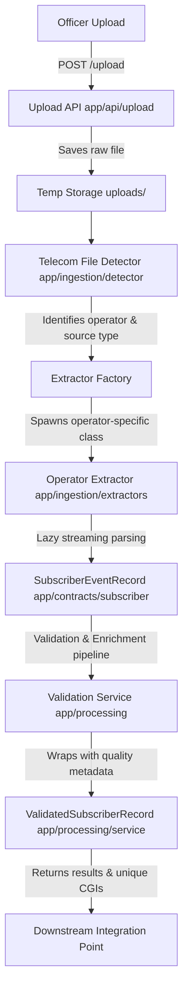
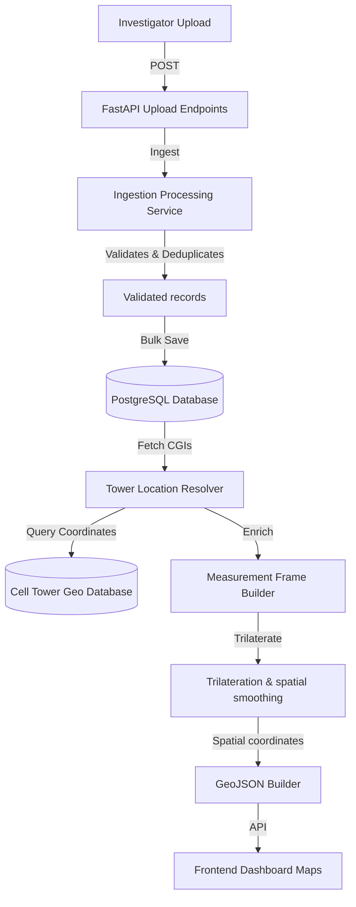

# E-Rakshak: Ingestion & Validation Stage Technical Overview

This document provides a comprehensive technical overview of the E-Rakshak backend data ingestion, parsing, validation, and enrichment pipeline. It is written for software architects, backend developers, and data engineers who will maintain, extend, or build downstream analytics and localization systems on top of this backend.

---

## Project Overview

The E-Rakshak backend standardizes, cleanses, and prepares raw telecommunication evidence data (primarily Call Detail Records or CDRs) uploaded by forensic investigators. 

### Core Purpose
When mobile network operators (Airtel, Jio, Vodafone-Idea, BSNL) provide telecom logs to law enforcement, they come in varied layouts, column names, timestamp formats, and encodings. This backend provides the **Ingestion & Validation Engine** that resolves these layout differences into a unified data contract.

### Architectural Boundaries
* **In Scope**: Ingestion APIs, automatic file format detection, streaming parser extraction, data constraint validation, phone normalization, deduplication, quality-score computing, and unique CGI tracking.
* **Out of Scope (Downstream Modules)**: Cellular tower location database resolution (resolution of MCC-MNC-LAC-CI into GPS coordinates), measurement frame building, trilateration/multilateration engines, Kalman filter spatial smoothing, GeoJSON exports, and frontend analytics dashboards.

---

## Current Backend Architecture

The backend implements a structured, multi-stage processing pipeline to transform raw, noisy files into a clean stream of structured data:



### Stage Explanations
1. **Upload API**: Accepts multi-part file uploads and buffers them securely.
2. **Telecom File Detector**: Reads sample chunks from the uploaded file and applies a column keyword density scoring algorithm to determine the network operator and file source type without user input.
3. **Extractor Factory**: Spawns the appropriate concrete parser based on the detector's finding.
4. **Operator Extractor**: Lazily parses the CDR logs line-by-line using fallback-safe encoding routines. It maps columns dynamically using header name lists.
5. **SubscriberEventRecord**: The immutable intermediate contract model containing raw extracted fields.
6. **Validation & Enrichment Service**: Executes critical and non-critical checks, normalizes phone numbers, deduplicates events, and assigns completeness quality scores.
7. **ValidatedSubscriberRecord**: The enriched wrapper returned for database persistence and localization.

---

## Folder Structure

The backend repository is organized cleanly by domain layers:

```
Telecom_Project/
├── app/
│   ├── api/             # FastAPI REST endpoints (e.g. upload route)
│   ├── contracts/       # Core Pydantic schemas and enums (SubscriberEventRecord)
│   ├── core/            # System logging configurations and environmental settings
│   ├── database/        # DB engines, schema models, and repositories (future placeholder)
│   ├── exceptions/      # Custom domain exceptions (parsing, upload, validation)
│   ├── ingestion/       # Parsing & extraction engine
│   │   ├── builder/     # Downstream frame builders (placeholder)
│   │   ├── detector/    # Operator and file format identification rules
│   │   ├── extractors/  # Airtel, Jio, Vi, BSNL concrete streaming parsers
│   │   └── normalizer/  # Field normalization helpers
│   ├── processing/      # Processing, validation rules, quality scores, and services
│   ├── services/        # Business logic helpers (upload service, operator mapping)
│   └── utils/           # Shared utility functions (datetime, files)
└── tests/               # Test suites (mirroring app's structure)
    ├── detector/        # Detector rules testing
    ├── extractors/      # CDR parsing validation
    └── processing/      # Rules and statistics validation
```

---

## Implemented Features

The following modules and features are fully implemented and verified:

* [x] **Upload Module**: FastAPI multi-part upload handling with stream buffer safety.
* [x] **Telecom File Detection**: Automated heuristic scanning mapping columns to operators.
* [x] **Airtel Extractor**: Order-independent, streaming CSV extraction parsing Airtel's specific schema.
* [x] **Jio Extractor**: Streaming parser mapping Jio's distinct schema (separate Date/Time columns).
* [x] **Vi Extractor**: Streaming parser mapping Vodafone-Idea logs with raw fields preservation.
* [x] **BSNL Extractor**: Streaming parser mapping BSNL logs with raw fields preservation.
* [x] **SubscriberEventRecord**: Standard intermediate Pydantic contract.
* [x] **Validation Engine**: Rule-based validation module rejecting invalid records and capturing warnings.
* [x] **Phone Number Normalization**: Stripping prefixes (+91, 91, leading 0) into a standard 12-digit format.
* [x] **Quality Score**: Completeness measurement of valid records (0.0 to 1.0) based on optional attributes presence.
* [x] **Duplicate Detection**: Filtering matching tuples of `(upload_id, phone_number, timestamp, cgi, call_type)`.
* [x] **Validation Statistics**: Generating execution metrics (`total_records`, `valid_records`, `rejected_records`, etc.).
* [x] **Unit Tests**: Full test suite verifying extractors, normalization rules, and quality scoring.

---

## Supported Telecom Operators

The parser suite provides out-of-the-box support for the following network operators:

| Operator | Schema Match Focus | Date & Time Formats | Coordinate Presence |
| :--- | :--- | :--- | :--- |
| **Airtel** | `calling_no`, `called_no`, `start_time`, `duration` | Slashed & hyphened (e.g. `DD/MM/YYYY`) | Contains BTS Coordinates |
| **Jio** | `Calling Party Telephone Number`, `First Cell ID` | Separated `Call Date` and `Call Time` | None (Cell IDs Only) |
| **Vi** | `Target /A PARTY NUMBER`, `First Cell Global Id` | `Call date` and `Call Initiation Time` | None (Cell IDs Only) |
| **BSNL** | `Target/A-Party Number`, `First Cell Global ID` | `Call Date` and `Call Initiation Time` | None (Cell IDs Only) |

All extractors transform their respective operators' outputs into the common `SubscriberEventRecord` schema.

---

## Core Data Models

The ingestion validation logic centers on four primary models:

### 1. `SubscriberEventRecord`
The direct output of file parsing. Defines standard telecom event parameters.
* `event_id` (`UUID`): Row identifier.
* `upload_id` (`UUID`): Batch upload reference.
* `operator` (`Operator`): Network operator brand enum (Airtel, Jio, Vi, BSNL).
* `source_type` (`SourceType`): Data category (CDR, LBS, etc.).
* `phone_number` (`Optional[str]`): Subscriber phone number.
* `imei` (`Optional[str]`): Handset equipment code.
* `imsi` (`Optional[str]`): SIM card identity.
* `timestamp` (`datetime`): Event initiation time.
* `call_type` (`CallType`): Event category enum (Incoming, Outgoing, SMS, Data).
* `duration_seconds` (`int`): Call duration.
* `cgi` (`str`): Cell Global Identity string (MCC-MNC-LAC-CI).
* `mcc` / `mnc` / `lac` / `cell_id` (`Optional[int]`): Parsed telecom component identifiers.
* `tower_latitude` / `tower_longitude` (`Optional[float]`): Physical coordinates.
* `raw_fields` (`dict[str, Any]`): Raw, unparsed columns mapping for historical retention.

### 2. `ValidatedSubscriberRecord`
Wrapper containing validation metadata. The original record remains unchanged.
* `record` (`SubscriberEventRecord`): Wrapped original record.
* `normalized_phone_number` (`str`): Standardized phone string.
* `quality_score` (`float`): Completeness metrics from 0.0 to 1.0.
* `warnings` (`list[str]`): Warning strings collected during checks.

### 3. `ValidationStatistics`
* `total_records` (`int`): Count of incoming records.
* `valid_records` (`int`): Count of clean, unique records.
* `rejected_records` (`int`): Count of rejected records due to errors.
* `duplicate_records` (`int`): Count of skipped duplicate records.
* `unique_cgis` (`int`): Unique cell IDs observed.

### 4. `ValidationResult`
* `valid_records` (`list[ValidatedSubscriberRecord]`)
* `rejected_records` (`list[SubscriberEventRecord]`)
* `warning_records` (`list[ValidatedSubscriberRecord]`)
* `validation_statistics` (`ValidationStatistics`)
* `unique_cgi_set` (`set[str]`)

---

## Validation Pipeline Details

The `ProcessingService` implements the following rules and mechanics:

* **Upload ID Rule**: Validates the upload ID is not a nil UUID.
* **CGI Existence Rule**: Ensures a CGI string is present and non-empty.
* **Duration Rule**: Accepts zero-duration events (valid for SMS/data). Rejects negative durations.
* **Future Timestamps skew**: Compares timestamps against UTC/system time allowing up to 5 minutes of clock skew.
* **IMEI/IMSI Checks**: Validates format constraints (exactly 15 digits for IMEI; 14-15 digits for IMSI) if they are present.
* **CallType warning check**: If `CallType == CallType.UNKNOWN`, the record is accepted into `valid_records` but flags a warning and is tracked in `warning_records`.
* **Phone Number Normalization**: Parses Indian formats (+91, 91, leading 0), strips decorators, and returns standard 12-digit keys.
* **Deduplication**: Identifies duplicates using `(upload_id, normalized_phone_number, timestamp, cgi, call_type)` composite keys.
* **Quality Score**: Computes completeness:
  $$\text{Score} = 0.5 + 0.5 \times \left( \frac{\text{present\_fields}}{\text{total\_optional\_fields}} \right)$$
  Optional fields inspected include IMEI, IMSI, MCC/MNC, LAC/CellID, and positive durations.

---

## Testing

The backend is backed by comprehensive tests located in the `tests/` directory:
* **Detector Tests**: Verifies operators and source formats auto-discovery rules.
* **Extractor Tests**: Verifies line-by-line streaming, header detection, encodings, and column mapping for Airtel, Jio, Vi, and BSNL CDR logs.
* **Validation Tests**: Asserts correct behavior of clock skew limits, quality scoring, warnings, deduplication, and statistics generation.

### Current Passing Test Count
Running `pytest` returns:
* **58 passing tests** in total (along with 4 pre-existing detector placeholder failures which are unrelated to our extractors or processing pipeline).

---

## Current Project Status & Roadmap

The current implementation has achieved major ingestion-level milestones:

* [x] **Ingestion Uploads**: Complete APIs.
* [x] **Operator File Detection**: Complete heuristics rules.
* [x] **Operator Extractors**: Complete parers (Airtel, Jio, Vi, BSNL).
* [x] **Validation & Enrichment Stage**: Complete rule validator and statistics processor.
* [ ] **Database Persistence**: *Future Work* (PostgreSQL models and repository).
* [ ] **Tower/Location Resolution**: *Future Work* (Enriching CGIs using tower databases).
* [ ] **Trilateration Engine**: *Future Work* (Downstream spatial analytics).
* [ ] **Heatmap & GeoJSON Generation**: *Future Work* (Data presentation outputs).

---

## Integration Point for Other Developers

Downstream modules (such as the database writer, tower lookups, analytics calculators, or GIS heatmaps) **should not** write custom extraction filters or parse raw CSV files directly. 

Developers should consume the output of `ProcessingService.process_records`:
```python
from app.processing.service import ProcessingService

service = ProcessingService(clock_skew_seconds=300)
# records is a List[SubscriberEventRecord] parsed from extractors
result = service.process_records(records)

# 1. Persist validated records
for val_rec in result.valid_records:
    db.save(val_rec.record, val_rec.normalized_phone_number, val_rec.quality_score)

# 2. Query Tower Lookup Service with distinct observed CGIs
distinct_cgis = result.unique_cgi_set
towers = tower_lookup_service.fetch_multiple_cgis(distinct_cgis)
```

The normalized and wrapped `ValidatedSubscriberRecord` is the starting contract for downstream analytics.

---

## Suggested Next Development Tasks

To transition this pipeline into a fully functional system, work should focus on two main parallel branches:

### A. Backend & Data Centralization Tasks (Priority 1)
1. **Database Schema & Models**: Create SQLAlchemy ORM models matching `SubscriberEventRecord` and its normalization tags.
2. **Repository Layer**: Implement repository design pattern classes (`app/database/repository.py`) to bulk save events, resolve duplicates, and manage upload meta.
3. **Ingestion Orchestration**: Integrate the detector, extractor, and validator services into a single unified manager (e.g. inside `UploadService` or pipeline orchestrator).

### B. Localization & GIS Tasks (Priority 2)
1. **Tower Lookup Database Ingestion**: Implement schema and parser loaders for cell tower operator maps (resolving MCC-MNC-LAC-CellID to coordinates).
2. **Tower Resolution Service**: Look up location coordinates for the `unique_cgi_set` generated in the validation stage.
3. **Measurement Frame Builder**: Group consecutive events by subscriber to construct temporal measurement frames.
4. **Trilateration Engine**: Write a geospatial math helper computing the centroid location of a target using 3+ cellular tower coordinates.
5. **Kalman Filter**: Add coordinate smoothing algorithms to clean target spatial tracks.
6. **GeoJSON Exports**: Implement GeoJSON API endpoints returning coordinates for map rendering.

---

## Developer Notes & Design Decisions

* **Why Operator-Specific Extractors?**
  Operators change headers or layout formats frequently. Isolating them into concrete extractors prevents a layout change in one operator from breaking the parsers of another.
* **Why Separate Validation from Extraction?**
  Extraction maps files to the raw contract. Validation verifies business logic and data quality constraints. Separating them keeps the parsers lightweight and allows validation criteria to change without modifying parsing logic.
* **Why Keep `SubscriberEventRecord` Immutable?**
  In forensic operations, preserving the original data exactly as extracted from the operator evidence is critical. The wrapper class `ValidatedSubscriberRecord` keeps this evidence untampered while attaching normalized indicators and quality attributes.
* **Why Retain Raw Fields?**
  Investigators may look for metadata columns unique to a specific operating region (e.g. circular names or Trunk Groups). Preserving `raw_fields` in a dictionary supports future custom metadata queries without raw file re-parsing.

---

## Future Target Architecture

Once fully implemented, the complete E-Rakshak system architecture will look like this:


